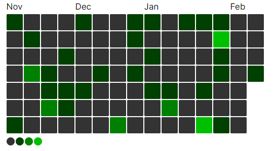

# react-date-heatmap

A React Component that allows you to visualize an array of dates in form of a heatmap.



## Installation

Install `react-date-heatmap` in your project using the following npm command:

```bash
npm install react-date-heatmap
```

Or with yarn

```bash
yarn add react-date-heatmap
```

After installation, you can use the ReactDateHeatmap component in your React project.

```jsx
import React from 'react';
import ReactDateHeatmap from 'react-date-heatmap';

const YourComponent = () => {
  const arrayOfDates = /* ... */;

  return (
    <ReactDateHeatmap data={arrayOfDates} />
  );
}

export default YourComponent;
```

## List of Props

| Name               | Type                         | Default Value | Description                                          |
| ------------------ | ---------------------------- | ------------- | ---------------------------------------------------- |
| `data`             | `Date[]`                     | -             | An array of dates to be visualized in the heatmap.   |
| `startDate`        | `Date`                       | -             | The start date for the heatmap range.                |
| `endDate`          | `Date`                       | -             | The end date for the heatmap range.                  |
| `rows`             | `number`                     | `7`           | Number of rows to display in the heatmap grid.       |
| `showMonths`       | `boolean`                    | `true`        | Display month indicators on the heatmap.             |
| `showShades`       | `boolean`                    | `true`        | Display shades indicating the quantity of each date. |
| `squareSize`       | `number`                     | `32`          | Size of each square in the heatmap grid.             |
| `squareColor`      | `string`                     | `"#00ff00"`   | Color of the filled squares in the heatmap.          |
| `textColor`        | `string`                     | `#000000`     | Color of the months text.                            |
| `emptySquareColor` | `string`                     | `"#333333"`   | Color of empty squares in the heatmap.               |
| `onSquareClick`    | `(entry: DateEntry) => void` | -             | Callback function triggered on square click.         |
| `hideTooltip`      | `boolean`                    | `false`       | Hide tooltips on square hover.                       |

## Types

### Date Entry

| Name        | Type      | Description                                    |
| ----------- | --------- | ---------------------------------------------- |
| `date`      | `Date`    | The date represented by the entry.             |
| `formatted` | `string`  | A formatted string representation of the date. |
| `active`    | `boolean` | Indicates whether the date is active or not.   |
| `quantity`  | `number`  | Quantity associated with the date.             |
